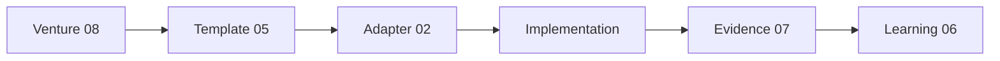

# Platform Adapter Design

## Adapter sözleşmesi

Her platform adaptörü şunları sağlar:

```
02-platforms/{platform}/
├── ADAPTER.md          # Overview + link to implementation
├── standards.md        # Platform-specific quality bar
├── architecture.md     # Stack + module shape
├── tooling.md          # Build, lint, CI commands
├── validation.md       # Adapter validation checklist
└── release.md          # Store / deploy process
```

Adaptör **sağlamaz:** governance tree, executive councils, duplicate knowledge OS.

## Adapter registry

| Platform | Durum | Implementation |
|----------|-------|----------------|
| **android** | Operational | Repo kökü — `templates/android/`, `scripts/init-new-app.sh` |
| **ios** | Blueprint | `ios/ADAPTER.md` |
| **web** | Blueprint | `web/ADAPTER.md` |
| **backend** | Blueprint | `backend/ADAPTER.md` |
| **ai** | Blueprint | `ai/ADAPTER.md` |

## Bağlantı modeli



## Android adapter (operational)

Canonical path: [`android/ADAPTER.md`](android/ADAPTER.md)

- **Dokunma politikası:** Android Factory frozen; bugfix ve sync-standards only.
- **SVOS kullanımı:** Venture charter → `05-templates/android-app` → mevcut `init-new-app.sh`.

## Yeni adapter ekleme checklist

- [ ] `ADAPTER.md` + 4 standart dosya
- [ ] `05-templates/{platform}-*` blueprint
- [ ] Validation script stub (blueprint aşamasında checklist yeterli)
- [ ] 01-core standards ile çapraz referans
