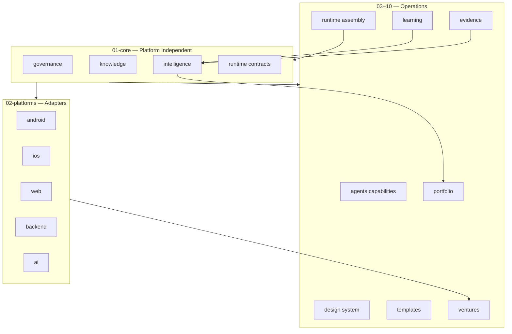

# SVOS Architecture

## Katman modeli



## Bağımlılık kuralları

1. **01-core** hiçbir platform adaptörüne bağımlı olamaz.
2. **02-platforms** yalnızca 01-core + kendi standartlarına bağımlı.
3. **08-ventures** platformdan bağımsız venture meta verisi tutar.
4. **07-evidence** ham veriyi tutar; **09-portfolio** yalnızca aggregate + allocation önerisi.
5. Android Factory (repo kökü) → `02-platforms/android/` üzerinden **referans** edilir; kod kopyalanmaz.

## WHAT vs HOW

| WHAT (venture) | HOW (adapter) |
|----------------|---------------|
| Problem, market, monetization | Kotlin / Swift / TS stack |
| Competition, positioning | Build, test, release pipeline |
| Results, evidence | CI, lint, platform QA |

## Veri akışı

```
Venture created (08)
    → Template selected (05)
    → Platform adapter engaged (02)
    → Agent capabilities invoked (03)
    → Design tokens applied (04)
    → Ship
    → Evidence ingested (07)
    → Learning updated (06)
    → Intelligence insight (01-core/intelligence)
    → Portfolio allocation hint (09) — when N≥1 ventures with outcomes
```

## Versiyonlama

| Bileşen | Versiyon dosyası |
|---------|------------------|
| SVOS | `APP-FABRIKASI/meta.json` |
| Android adapter | `../.factory/meta.json` (frozen) |
