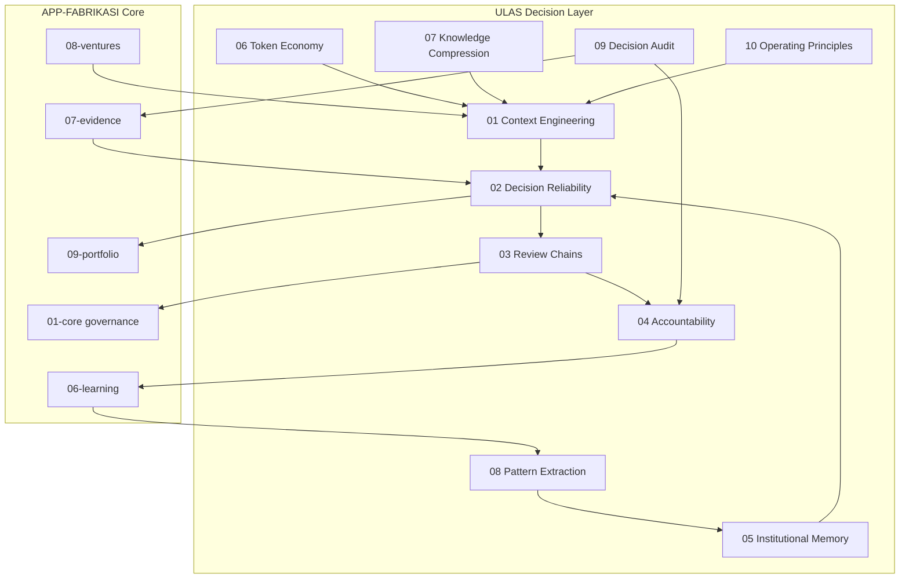

# ULAS Architecture

## Katman pozisyonu

ULAS, SVOS'un **01–10** katmanlarının **üzerinde** çalışan çapraz karar katmanıdır:

- `01-core/governance` → **ne** onaylanır (kurallar)
- `ULAS` → **nasıl** güvenilir onaylanır (disiplin)

## Veri akışı

1. Venture talebi → `01-context-engineering` manifest assemble
2. `READ_MORE_REQUIRED` yoksa → `02-decision-reliability` confidence
3. Confidence ≥ threshold → `03-review-chains` matrix
4. Onay → execution; ret → gap log
5. Sonuç → `09-decision-audit` + `04-accountability`
6. Failure → `05-institutional-memory` NEVER_AGAIN candidate
7. Outcome → `08-pattern-extraction` → `06-learning`

## Dosya türleri

| Tür | Örnek |
|-----|-------|
| Standard | `STANDARDS.md`, `*_FRAMEWORK.md` |
| Schema | `*.schema.json` |
| Registry | `never-again.json`, `review-matrix.json` |
| State | `10-runtime/ulas/` (venture-specific, gitignored raw) |
