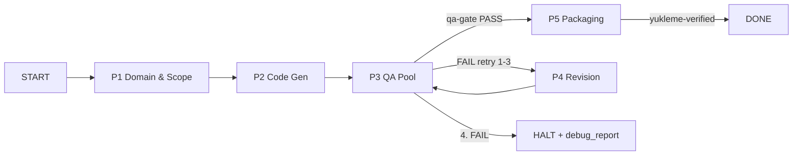

> ⚠️ Bu repo arşivlenmiştir. Aktif geliştirme: https://github.com/UlasKasikci/repo

# App-Fabrika Web Edition

**Freelance web projesi üretim fabrikası:** deterministik state graph, 5 ajanlı
denetim, IDE-agnostik kontratlar ve 14 kontrollü QA gate ile PHP/MySQL projelerini
tek komutla üretir.

Eksik CRUD, unutulan RBAC, kırık bağımlılık ve token israfı problemlerini çözer:
her proje aynı kapılardan geçer — domain analizi → kod → QA → paketleme.
Üç IDE (Cursor / OpenCode / Claude Code) aynı `.factory/` state'ini okur/yazar.

[](https://github.com/clariongemini/APP-FABRIKA/actions/workflows/validate.yml)
[](LICENSE)
[](scripts/web/self-test.sh)

---

## Problem ve Çözüm

| Problem | Çözüm |
|---------|-------|
| Her projeye sıfırdan başlama | `bootstrap-project.sh` + iskelet kopyalama |
| Eksik CRUD / unutulan RBAC / kayıp KVKK | P1 proaktif domain denetimi (module_matrix kapısı) |
| Kırık bağımlılık, sessiz hata | QA gate: 14 kontrol, 0 Error / 0 Warning zorunlu |
| Token israfı (14M/proje) | model routing, batch yazma, watchdog; hedef 3-4M |
| IDE kilitlenmesi | IDE-agnostik kontratlar (`.factory/contracts`) |

---

## Mimari Genel Bakış

### State Graph



```text
START → P1 → P2 → P3 ──PASS──→ P5 → DONE
                 │
                 ├─FAIL (retry 1-3)→ P4 → P3
                 └─4. FAIL → HALT + debug_report.json
```

- Kapı artefaktları: P1 `domain-report.json` (şema doğrulanır) · P3 `qa-gate.sh`
  exit 0 · P5 `packaging-report.json` result=PASS.
- `max_retries: 3` — 4. başarısızlık HALT; sonsuz döngü yok.
- `additionalProperties: true` şemalar korunur (opsiyonel alan ekleme serbest).

### Ajanlar (5)

| # | Ajan | Dosya | Faz | Sorumluluk |
|---|------|-------|-----|-----------|
| 1 | Requirement & Domain Architect | `.cursor/agents/web-domain-architect.md` | P1 | İstek ayrıştırma; eksik modül (RBAC, sepet, KVKK) proaktif enjeksiyonu |
| 2 | Core Web & Database Engineer | `.cursor/agents/web-core-engineer.md` | P2, P4 | PHP 8.1+ MVC çekirdek, PDO şema, normalize SQL |
| 3 | UI/UX & Frontend Specialist | `.cursor/agents/web-frontend-specialist.md` | P2 | Semantik HTML5, erişilebilir, SEO dostu arayüz |
| 4 | QA & Security Gatekeeper | `.cursor/agents/web-qa-gatekeeper.md` | P3 | `qa-gate.sh` işletir; PASS vermeden faz geçişi yok (`readonly`) |
| 5 | Production Deployment & Packager | `.cursor/agents/web-deploy-packager.md` | P5 | Build isolation + `Yukleme/` üretimi |

Tek ajan onayı yasaktır: P1→P2 yalnız domain raporuyla, P3→P5 yalnız QA PASS'ıyla.

### Katmanlar

```text
┌─ Kontratlar ── .factory/contracts/*.schema.json (P1/P3/P5 artefakt doğrulama)
├─ Ajanlar ───── .cursor/agents/ + .opencode/agent/ + .cursorrules + CLAUDE.md
├─ QA Gate ───── scripts/web/qa-gate.sh (14 kontrol, 0 Error 0 Warning)
└─ Paketleme ─── scripts/web/package-yukleme.sh (staging → smoke → arşiv → takas)
```

---

## Dosya Yapısı

```text
app-fabrika/
├── .cursor/                  # Cursor IDE config
│   ├── rules/                # Proje kuralları
│   └── agents/               # 5 ajan tanımı
├── .opencode/                # OpenCode CLI config
│   ├── agent/                # 5 ajan tanımı (paralel)
│   ├── skills/               # Modül iskeletleri (kvkk-compliance, admin-crud, auth-rbac)
│   └── command/              # Slash komutlar (/web-baslat, /web-denetle, ...)
├── .factory/                 # Runtime state (proje-başına)
│   ├── contracts/            # p1/p3/p5 JSON şemaları
│   ├── web-state-graph.json  # State graph kontratı
│   ├── web-state.example.json
│   ├── model-pricing.json    # Model rate kartları
│   ├── e2e-runs/             # E2E koşu arşivi (yerel, commit dışı — bulgular docs/findings/)
│   └── metrics.jsonl         # Token/latency/model_used (proje-başına)
├── scripts/web/              # Orkestrasyon
│   ├── orchestrate.sh        # Faz sürücüsü (--auto / --strict)
│   ├── state.sh              # State geçişleri (start/advance/qa-pass/qa-fail)
│   ├── qa-gate.sh            # 14 kontrol
│   ├── frontmatter-check.sh  # Frontmatter kontratı (qa-gate 14. kontrol)
│   ├── package-yukleme.sh    # Paketleme (staging → smoke → arşiv → takas)
│   ├── smoke-test.sh         # php -S + curl canlı doğrulama
│   ├── sql-dump.sh           # Deterministik SQL dump (drift'e karşı)
│   ├── bootstrap-project.sh  # Yeni proje başlatma
│   ├── e2e-driver.sh         # E2E driver + idle watchdog (L3)
│   ├── lighthouse-verify.sh  # Lighthouse (raporlayıcı, opsiyonel)
│   └── self-test.sh          # 30 senaryo
├── docs/                     # Kanonik dokümanlar
│   ├── WEB-EDITION.md        # Teknik spesifikasyon
│   ├── MASTER-PROMPT-V2.md   # Stratejik karar + K1-K8
│   ├── FAZ2-PLAN.md          # Token ekonomisi planı
│   ├── audits/               # CONTRACT-AUDIT + REVIEW-NOTES (K8)
│   ├── protocols/            # E2E protokol notları + rapor taslakları
│   └── findings/             # E2E kalıcı bulgular (run dir commit dışı)
├── tests/                    # Fabrika testleri
├── CLAUDE.md                 # Claude Code CLI direktifleri
├── .cursorrules              # Cursor kuralları
├── antigravity.yaml          # Antigravity/Freebuff config
└── opencode.json             # OpenCode config
```

---

## Hızlı Başlangıç

### Gereksinimler

- `bash` · `php` 8.1+ (CLI) · `python3` · `git` · `shasum`
- Opsiyonel: `node`/`npm` (eslint, minify, lighthouse), `composer global`
  (`phpstan/phpunit/phpunit` — qa-gate için zorunlu)

### Kurulum

```bash
git clone https://github.com/clariongemini/APP-FABRIKA.git && cd APP-FABRIKA

# phpstan + phpunit (qa-gate'in asimetrik çekirdeği)
composer global require phpstan/phpstan phpunit/phpunit

# fabrika kendini sınamalı
bash scripts/web/self-test.sh          # hedef: 30/30 PASS
```

### Yeni proje

```bash
# dry-run (default) — ne kopyalanacağını gösterir
bash scripts/web/bootstrap-project.sh ../my-project

# uygula
bash scripts/web/bootstrap-project.sh ../my-project --yes
```

### Üretim hattı

```bash
cd ../my-project

bash scripts/web/state.sh start          # P1, retry=0
bash scripts/web/orchestrate.sh . --auto # P1 → P2 → P3 sürüşü (artifact kapıları)
bash scripts/web/qa-gate.sh .            # 0 Error, 0 Warning olmadan P5 yok
bash scripts/web/package-yukleme.sh .    # Yukleme/ (yalnız QA PASS sonrası)
bash scripts/web/state.sh status         # aktif faz
```

Çıkış kodları: `0` OK · `1` FAIL · `2` HALT · `3` orkestratör bekleme (LLM adımı).

### Ortam Değişkenleri

| Değişken | Varsayılan | Ne işe yarar |
|----------|-----------|--------------|
| `MODEL_P1` / `MODEL_P2` / `MODEL_P4` | hardcoded map | Faz bazlı model routing (`provider/model`) |
| `STRICT_TOTAL_TOKENS` | 8.000.000 | `--strict` toplam bütçe eşiği (2× → exit 1) |
| `STRICT_PHASE_TOKENS` | 6.000.000 | P2-P4 tek faz eşiği |
| `STRICT_WALL_MS` | 10.800.000 | Duvar saati bütçesi (3 saat) |
| `SMOKE_PORT` / `SMOKE_PATHS` | 18000+ | Smoke test portu / ek rotalar |
| `LIGHTHOUSE_URL` | — | Tanımlı değilse Lighthouse SKIPPED |
| `E2E_TIMEOUT_SEC` / `E2E_MAX_TOKENS` | 10.800 / 15M | E2E driver dış watchdog bütçesi |

---

## Kullanım — Üç IDE

| IDE | Config | Kullanım |
|-----|--------|----------|
| Cursor | `.cursor/` + `.cursorrules` | Klasörü aç; 5 ajan + kurallar otomatik yüklenir |
| OpenCode | `.opencode/` + `opencode.json` | `opencode run --agent web-core-engineer` · `/web-baslat` |
| Claude Code | `CLAUDE.md` | `claude` CLI repoyu açınca direktifleri otomatik okur |

- Her IDE aynı `.factory/` state'ini okur/yazar; IDE değişimi state kaybı yaratmaz.
- Komut eşlemesi (`docs/WEB-EDITION.md` §10): `/web-baslat` · `/web-denetle` ·
  `/web-yukle` · `/web-faz`.
- ⚠ exFAT/FAT32 hacimlerde `find . -name '._*' -delete` — AppleDouble ikizleri
  komut/ajan listesini bozar.

---

## QA Gate — 14 Kontrol

`bash scripts/web/qa-gate.sh <proje>` → **0 Error, 0 Warning** zorunlu.

| # | Kontrol | Ne yapar | FAIL koşulu |
|---|---------|----------|-------------|
| 1 | `php_lint` | Tüm `.php` dosyalarına `php -l` | Sözdizimi hatası |
| 2 | `structure` | MVC yapısı (`core/`, `views/`, `index.php`) | Dosya eksik |
| 3 | `sql_schema` | FK + index + seed + RBAC + sepet | Eksik CONSTRAINT/INSERT |
| 4 | `security_grep` | OWASP grep: eval, `mysql_*`, ham md5, superglobal-in-query | Eşleşme |
| 5 | `security_policy` | CSRF'siz POST, ham çıktı basımı | Eşleşme |
| 6 | `password_policy` | `PASSWORD_ARGON2ID` / `BCRYPT` cost ≥ 12 | Zayıf hash |
| 7 | `phpstan` | Level 8 statik analiz (zorunlu çekirdek) | Yapılandırma/araç yoksa |
| 8 | `phpunit` | Birim testleri (zorunlu çekirdek) | Yapılandırma/araç yoksa |
| 9 | `eslint` | JS lint | Yapılandırma yoksa SKIPPED (tek tolerans) |
| 10 | `sql_dump` | Üretilen dump = commit'li dump (byte) | Drift |
| 11 | `kvkk` | intent=kvkk\|gdpr → legal view + consent + 2 tablo | Eksik (none → SKIPPED) |
| 12 | `domain_report` | P1 artefaktı: module_matrix ≥4, dolu evidence/justification | Şablon/uydurma kanıt |
| 13 | `static_coverage` | `phpstan ∧ phpunit` | Aksi her koşulda FAIL |
| 14 | `frontmatter` | Fabrika agent/rule/skill frontmatter kontratı (`mode`/`permission`/`globs`/K1-K8 ref) | Ref üstte, dead rule, eksik alan (K6 istisnası — somut regresyon) |

Çıktılar: `qa-report.json` (her koşuda) · `debug_report.json` (yalnız FAIL).

---

## Paketleme — `Yukleme/` Çıktısı

```text
staging (.factory/yukleme-staging)
   → smoke-test.sh (php -l + php -S + curl; FAIL → paket reddedilir)
   → mevcut Yukleme/ arşive taşınır (.factory/yukleme-archive/<ts>-<hash>/)
   → staging atomik takasla Yukleme/ olur
   → packaging-report.json (sha256 manifest)
```

```text
Yukleme/
├── assets/{css,js,images}/
├── core/  ├── views/
├── SQL/veritabani.sql          # CREATE TABLE + FK + seed, UTF-8
├── .htaccess  ├── index.php
├── robots.txt ├── sitemap.xml
```

- **Girmez:** `node_modules/`, `.git/`, `.env` (`.env.example` serbest), testler,
  `.scss`/`.ts` kaynakları, `.factory/`, raporlar.
- `MANIFEST.json` yalnız arşiv/failed içine yazılır; final paket ağacı sabittir.

---

## Yol Haritası

### v1 — Starter Kit (Şimdi)

- Bootstrap + üç IDE config + QA gate (14) + paketleme + self-test (30)
- **Tamamlandı:** A1 okuma yasağı + QUESTIONS kapısı (`e946064`) + A2 spike→write
  (`801dbef`) + A2' duvar-saati (`fa45b28`) + L3 watchdog idle+stream+CPU+no-write-cap
  (`72bbee7`) + frontmatter kontratı + manifest-onaylı whitelist + `.cursor/rules`
  5 mdc + `.opencode/skills` iskeleti
- **Kalan:** Tur 2-3 tam E2E doğrulaması (canlı, 2026-10-09T15:52Z) — kabul:
  att≤3 · P2<8sa · P2 token<12.23M · write>0 · L3 kill=0 (aynı intent `2e4816…`;
  FINDINGS-PILOT §6) · sonuç gelince v1.0 final kararı

### v2 — Optimize (2-3 ay)

- JEV model routing + bağlam pruning → **hedef %20-30 P2 token düşüşü**
- Modül kütüphanesi (`.factory/modules/`): KVKK, admin-CRUD, auth-RBAC
  → LLM çağırmadan kopyalama
- **Hedef:** 14M → 3-4M token (Cursor Pro tek paket)
- Kapı: JEV on/off E2E karşılaştırması ≥%20 · modül kısımlarında ≥%80 ·
  5+ E2E dağılımı ile per-model `--strict` eşikler

### v3 — Kalibre (6-12 ay)

- Tüm modüller şablonlaşmış; <1M token ütopyası ama istikamet
- Çoklu dil/framework desteği (opsiyonel)

---

## Release

| Sürüm | Durum | Not |
|-------|-------|-----|
| **v1.0-rc1** | **Release Candidate** (2026-10-09) | Starter Kit — Tur 2-3 E2E onayı bekliyor |
| v1.0 | Planlı | Tur 2-3 PASS → final; Kısmi → v1.1 (model hızı); FAIL → A2'' iterasyon |
| v2 | Planlı | JEV routing + modül kütüphanesi |
| v3 | Vizyon | Şablonlaşma, <1M token istikameti |

rc1, Tur 2-3 sonucundan **bağımsız**dır: kod tabanı CI yeşil + self-test 30/30 ile
donmuştur; E2E sonucu yalnız v1.0 final onayını etkiler (K7: tek kol tek tur).

---

## Bilinen Sorunlar

- **P2 model hızı:** glm-5.3 pilotda 30dk'da iskeleti tamamlayamadı (kill yok —
  yavaş ama üretken). Tur 2-3 tam bütçeyle ölçüyor; eşik: P2 < 8 saat.
- **B2 write SchemaError ~%6.8:** harness-side NDJSON şema kayması (prompt ile
  çözülemez; schema-recovery devrede — P1'de 3× tetiklendi, kurtarıldı).

---

## Değişmez Kurallar (K1-K8)

Tam metin: [`docs/MASTER-PROMPT-V2.md`](docs/MASTER-PROMPT-V2.md)

| # | Kural | Tek cümle |
|---|-------|-----------|
| K1 | Hard-kill yasak | Reasoning spike'ta kesme = üretken attempt'i öldürür (imza-c) |
| K2 | İmza-bazlı tedavi | Aynı spike (b)'de ölü, (c)'de canlı; kök nedeni tedavi et |
| K3 | Ölçmeden karar yok | Spekülatif eşik değişikliği ve n=2 hüküm yasak |
| K4 | Kontrat tamlığı > yasak | Eksik kontrat + yasak = sessizce yanlış üretim |
| K5 | Belge kanıttan türesin | `[x]` yalnız qa-gate PASS sonrası; halüsinasyon yasak |
| K6 | Denetim %90'da donduruldu | Yeni QA kontrolü yalnız somut bug için |
| K7 | İki imza, iki kol | Model + bağlam değişimi aynı turda test edilmez |
| K8 | Silme değil işaretleme | Reddedilen yaklaşım `docs/audits/REVIEW-NOTES`'a yazılır |

---

## Katkı

1. Issue aç veya PR gönder — PR'da `bash scripts/web/self-test.sh` **30/30 PASS**
   ve CI yeşil olmalı.
2. Yeni QA kontrolü yalnız somut bir bug raporuyla eklenir (K6).
3. Doküman güncellemeleri kanıttan türetilir (K5).

## Lisans

[MIT](LICENSE) © 2026 UlasKasikci
