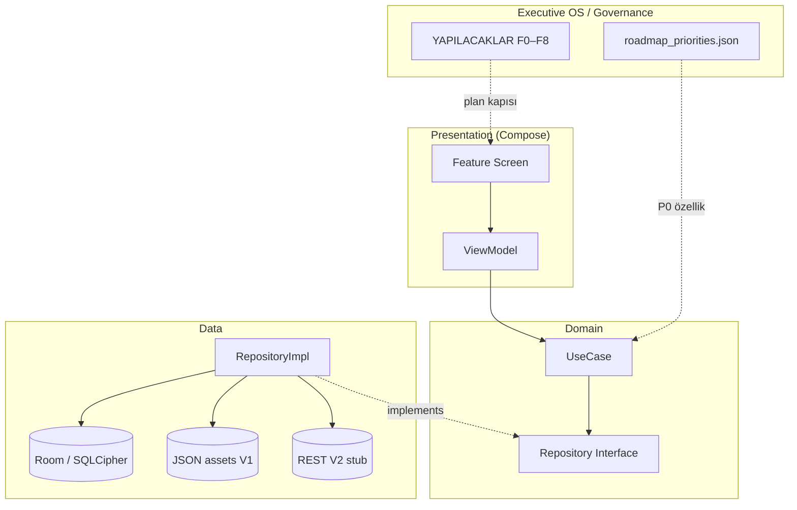

# Veri Akışı — Factory şablonu

> **Package:** `com.ulas.factory` · **Faz:** F2 Kat Döşeme

## Üst seviye akış



## Offline-first (V1)

| Adım | Akış |
|------|------|
| 1 | UI → ViewModel → UseCase |
| 2 | UseCase → Repository |
| 3 | Repository → Room + `assets/locales` / JSON |
| 4 | Hata → `Result` / UiState |

## Sync (V2 — planlı)

| Adım | Akış |
|------|------|
| 1 | Network modülü REST çağrısı |
| 2 | Repository conflict resolution |
| 3 | Room güncelleme → UI reaktif (Flow) |

## Güvenlik katmanı

```
presentation → domain
core/security → EncryptedSharedPreferences, root check (app başlangıcı)
core/database → SQLCipher
feature/premium → Play Billing + Integrity
```

## Fabrika vs uygulama projesi

| | Fabrika repo | Bootstrap edilmiş app |
|---|--------------|------------------------|
| Kod | `templates/android/project/` | Hedef proje dizini |
| Governance | Charter + script | `init-governance.sh` runtime |
| Veri akışı | Bu belge + MODULE_MAP | Proje özel genişletme |

## İlgili

- [MODULE_MAP.md](./MODULE_MAP.md)
- [ANDROID_STRUCTURE.md](./ANDROID_STRUCTURE.md)
- [AI Studio import](../AI_STUDIO_IMPORT.md)
