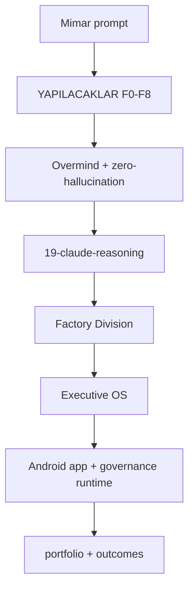

# Factory Evolution Directive — Gap Analysis & Audit

**Date:** 2026-06-14  
**Repo status:** FROZEN · MAINTENANCE · PRODUCTION_READY  
**Directive source:** Android Product Factory (12-layer) evolution prompt  
**External reference:** [CL4R1T4S](https://github.com/elder-plinius/CL4R1T4S) — agent system design patterns (not prompt copying)

> **Policy:** This document satisfies the strategic audit request. **Implementation of new agents, councils, or layers is forbidden** until production evidence (`.factory/freeze.json`). The repo already maps ~85% of the directive; the gap is **execution proof**, not architecture.

---

## Executive summary

| Question | Answer |
|----------|--------|
| Is this repo an Android Product Factory? | **Yes** — scaffold, governance, intelligence, portfolio, outcomes |
| Does it need 12 new layers + 6 new directors? | **No** — would duplicate CEO/CPO/Architect/Security/AID/CAO and violate freeze |
| What is actually missing? | **Production evidence**, automated perf budgets in CI, app-type blueprints (post-validation), migration engine |
| Production readiness (factory template) | **92/100** |
| Production readiness (proven factory) | **~60/100** — zero shipped apps with outcomes |

---

## CL4R1T4S — what to adopt (and what not)

[CL4R1T4S](https://github.com/elder-plinius/CL4R1T4S) documents how advanced coding agents structure behavior: explicit instructions, tool loops, refusal boundaries, persona scoping.

| Pattern (industry) | Already in this repo | Action |
|--------------------|----------------------|--------|
| Think before code | `19-claude-reasoning.mdc`, `CLAUDE_REASONING.md` | Keep — do not duplicate |
| Negative constraints | `<negative_constraints>` in reasoning rule | Keep |
| Tool orchestration | MCP P0 (Browser, GitHub), terminal bridge | Keep |
| Context budget | `CURSOR_CONTEXT_BUDGET.md`, layer slices | Keep |
| Stage gates | YAPILACAKLAR F0–F8 | Keep |
| Hierarchical audit | `HIERARCHICAL_AUDIT_CHAIN.md` | Keep |
| **Copy leaked prompts / jailbreaks** | — | **Never** — security & integrity risk |
| **Prompt injection to bypass rules** | — | **Forbidden** — contradicts zero-hallucination |

**Principle:** Use CL4R1T4S for **observability of agent design**, not as a source to paste proprietary system prompts into `.cursorrules`.

---

## 1. Repository gap analysis

### Layer 1 — Executive governance (requested vs existing)

| Requested | Existing mapping | Gap |
|-----------|------------------|-----|
| CEO Agent | `11-ceo-agent.mdc`, CEO cycle, sprint lock | None |
| CTO Agent | **Chief Architect** `02-architect.mdc` + CEC | Naming only — do not add CTO |
| Product Director | **CPO** `01-product-cpo.mdc` + **PDC** `09-product-decision-council.mdc` | None |
| Security Director | **Auditor** `04-auditor-security.mdc` + `SECURITY.md` | None |
| QA Director | Auditor + OEM + `factory-quality-gate.sh` + pre-commit | Formal "QA Director" rule redundant |
| Performance Director | `PERFORMANCE.md` + Auditor layer 21/32 | **CI perf budget automation** — backlog |

**Verdict:** Layer 1 is **implemented** via 16 agents + Executive OS. Adding parallel directors = governance duplication.

### Layer 2 — Autonomous delivery system

| Stage | Implementation |
|-------|----------------|
| Idea → Validation | F1 CPO, PDC, Mavi Okyanus |
| Specification | YAPILACAKLAR, PRODUCT_BRIEF |
| Architecture | F2, MODULE_MAP, 33 layers |
| Implementation | F3–F7, Android Elite |
| Testing | F5, `TESTING.md`, Maestro template |
| Security review | F5, audit-security |
| Performance review | PERFORMANCE.md (manual) |
| Documentation | CHANGELOG, ADR via factory/memory |
| Release readiness | F8, RELEASE_CHECKLIST, approval gate |

**Gap:** Performance review not automated in CI (Macrobenchmark / baseline profiles backlog).

### Layer 3 — System architecture standards

| Standard | Location |
|----------|----------|
| Clean Architecture | `ANDROID_STRUCTURE.md`, 10 modules |
| Feature modules | `feature:*` in template |
| DDD / domain layer | `domain/`, use cases |
| Dependency rules | `governance/dependency-rules.json`, audit-module-map |
| Offline-first | Layer 9, architect rule |
| Testability | TESTING.md, Hilt test hooks |

**Verdict:** **Complete** for template; enforced per-project after `init-new-app.sh`.

### Layer 4 — AI development standards

| Requirement | Implementation |
|-------------|------------------|
| Think before coding | `19-claude-reasoning.mdc` |
| Search before create | `00-overmind-zero-hallucination.mdc` |
| Reuse / no duplicate | Architect + Android rules |
| Reasoning reports | thinking / architecture_check blocks |
| Never skip tests/security | Auditor, pre-commit |

**Verdict:** **Complete** — aligns with top-tier agent patterns without CL4R1T4S prompt leakage.

### Layer 5 — Product factory templates (app-type blueprints)

| Blueprint | Status |
|-----------|--------|
| Media / AI / Chat / Subscription / Offline / Utility / Content | **Not in repo** — by design (freeze) |
| Generic Android scaffold | `templates/android/project/` ✅ |
| App-type profiles (evaluation) | `governance/blue_ocean/APP_TYPE_PROFILES.md` ✅ |

**Gap:** Per-vertical **code blueprints** — backlog **after** first 3 shipped apps reveal which verticals matter.

### Layer 6 — Quality operating system

| Gate | Script |
|------|--------|
| Build | `ci-template-build.sh`, gradle-build-loop |
| Lint / static | validate-code, audit-layers |
| Security | audit-security.sh |
| Governance | validate-audit-chain, validate-yapilacaklar |
| Composite | `factory-quality-gate.sh` (100/100) |
| Unit/integration in CI | Template has test dirs; **full CI matrix** — partial |

**Gap:** Dependency audit (OWASP/Gradle) in CI — backlog.

### Layer 7 — Performance governance

| Item | Status |
|------|--------|
| Budgets documented | `PERFORMANCE.md` ✅ |
| Automated reporting | ❌ backlog |
| Macrobenchmark / baseline | ❌ backlog |

### Layer 8 — Security governance

| Item | Status |
|------|--------|
| Secure storage | SECURITY.md, SQLCipher template |
| API keys | .gitignore, EncryptedSharedPreferences |
| Permissions | Privacy + manifest standards |
| Supply chain | Dependabot (if enabled on GitHub) — verify per org |

**Verdict:** **Strong** at standard level; automated dependency gate = backlog.

### Layer 9 — Knowledge system

| Item | Status |
|------|--------|
| ADR | factory/memory, lessons |
| Playbooks | `docs/03-STANDARDS/*` |
| Lessons learned | factory/memory failures.json (runtime) |
| Anti-patterns | factory/regression catalog |
| Project learning | `run-learning-loop.sh`, proof engine |

**Verdict:** **Implemented** (V3 intelligence); fills from **real projects**, not more docs.

### Layer 10 — Release factory

| Item | Status |
|------|--------|
| Release checklist | `docs/RELEASE_CHECKLIST.md` ✅ |
| Rollback | STATE_RECOVERY.md (dev); Play rollback — ops |
| Crash monitoring | FCM + standards; Firebase per-project |
| Analytics validation | AID Sprint P, validate_sprint_p_activation |
| Store readiness | F8, certification scaffold |

### Layer 11 — Project self-audit (0–100)

| Item | Status |
|------|--------|
| Factory health | `factory-health.sh` (repo) |
| Factory success | `build-factory-kpi.py` (portfolio) |
| Per-app 10-category score | **Partial** — certify-app.py GOLD/SILVER; full 10-dimension auto plan — backlog |

### Layer 12 — Future proofing

| Item | Status |
|------|--------|
| Multi-agent | 16 agents + subagents ✅ |
| Wear / XR / Auto | **Not scaffolded** — intentional; add when product needs |
| On-device AI | **Not scaffolded** — add per app blueprint |

**Verdict:** Future surfaces are **product-driven**, not factory-meta-driven.

---

## 2. Missing systems report

| Priority | Missing system | Why not now |
|----------|----------------|-------------|
| P0 | Shipped app + outcomes | Validates entire factory |
| P1 | `factory-doctor.sh` | Needs real "sick" projects |
| P1 | `migrate-project.sh` | See `FACTORY_UPGRADE_STRATEGY.md` |
| P2 | App-type code blueprints | After vertical proof |
| P2 | CI performance budgets | After baseline from real app |
| P3 | Factory compatibility matrix | After 2+ apps on different factory versions |
| **Rejected** | CTO/QA/Performance **new agents** | Duplicates existing; freeze |

---

## 3. Governance report

**Current model:** CEO → CAO → EGC, with PDC, CEC, CDID, 16 department agents, hierarchical audit (no single-agent approval).

**Directive alignment:** The 12-layer prompt describes a **smaller** executive team than you already have. Consolidation would **reduce** capability.

**Recommendation:** Keep governance frozen. Tune **charters**, not headcount.

---

## 4. Architecture report

```
Factory Core          init-new-app.sh · sync-standards.sh
Governance Core       F0–F8 · Executive OS · 33 layers
Intelligence Core     proof · memory · decision_accuracy · revenue · benchmark
Productization        portfolio · outcomes · certification · regression
Measurement           AID · outcomes · factory_kpi
```

**Strength:** Single source of truth, modular Android template, dependency rules.  
**Weakness:** No automated perf/security dependency gates in GitHub Actions yet.

---

## 5. AI agent framework design (as-is — do not expand)



**Do not add:** parallel agent trees per CL4R1T4S vendor folder — your factory **is** the Cursor agent system.

---

## 6. Repository restructure proposal

**Proposal: no structural restructure.**

| Alternative | Verdict |
|-------------|---------|
| Merge governance into `factory/` | Already done (runtime consolidation) |
| Add `executive/cto/` department | **Reject** — freeze |
| Add `blueprints/media/` | **Defer** — post-validation |
| Add `docs/FACTORY_EVOLUTION_*` only | **Done** — this file |

---

## 7. Priority roadmap

### Now (MAINTENANCE — allowed)

1. Bugfix, docs, sync-standards improvements  
2. Target project: `sync-standards.sh` → `/baslat` → ship  
3. `record-outcome.py` when Play data exists  

### After 1 shipped app + outcomes

4. `factory-doctor.sh` (read-only audit of imported projects)  
5. CI: dependency audit + optional Macrobenchmark job  

### After 3 apps + freeze lift

6. App-type blueprints (top 2 verticals only)  
7. `migrate-project.sh` v1  
8. Factory compatibility matrix  

### Never (unless product proof demands)

- V5 meta-factory layers  
- Duplicate executive agents from directive  

---

## 8. Production readiness score

| Category | Score | Notes |
|----------|-------|-------|
| Architecture | 10/10 | 33 layer + 10 module |
| Factory design | 10/10 | init + sync |
| Governance | 9.5/10 | Complete; complexity cost |
| Agent structure | 9.5/10 | 16 agents sufficient |
| Context management | 10/10 | Budget + slices |
| Scalability | 9/10 | Portfolio scaffold |
| Documentation | 10/10 | TR/EN README |
| Productization | 9.5/10 | outcomes layer |
| **Real world validation** | **6/10** | No shipped proof |
| **Revenue validation** | **0/10** | No outcomes data |
| **Template readiness** | **92/100** | |
| **Proven factory** | **~60/100** | Evidence pending |

---

## 9. World-class engineering upgrade plan

**Phase A — Product execution (now)**  
Ship one app through full chain: sync → F0–F8 → AID ACTIVE → Play → outcome JSON.

**Phase B — Operational tooling (after evidence)**  
doctor · migrate · compatibility matrix · CI perf/dependency gates.

**Phase C — Vertical blueprints (after 3 apps)**  
Only for proven app types (media, utility, etc.) — max 2 templates.

**Anti-pattern to avoid:** Using [CL4R1T4S](https://github.com/elder-plinius/CL4R1T4S) or similar to inflate agent count, copy leaked prompts, or bypass factory gates. Transparency means **understanding** agent design — not **weakening** yours.

---

## Directive compliance matrix

| Layer | Covered | Action |
|-------|---------|--------|
| L1 Executive | ✅ 100% | None |
| L2 Delivery | ✅ 95% | Auto perf gate |
| L3 Architecture | ✅ 100% | None |
| L4 AI standards | ✅ 100% | None |
| L5 Blueprints | ⚠️ 30% | Post-validation |
| L6 Quality OS | ✅ 90% | Dep audit CI |
| L7 Performance | ⚠️ 60% | Macrobenchmark |
| L8 Security | ✅ 90% | Dep audit CI |
| L9 Knowledge | ✅ 85% | Fill from apps |
| L10 Release | ✅ 90% | None |
| L11 Self-audit | ⚠️ 70% | doctor.sh later |
| L12 Future | ⚠️ 40% | Product-driven |

---

**North star:** [`FACTORY_MISSION.md`](../FACTORY_MISSION.md) · **Freeze:** [`FACTORY_FREEZE.md`](FACTORY_FREEZE.md)
